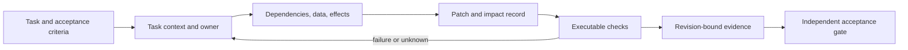

# AGENT Principles

**Architecture for code maintained by autonomous agents.**

Make the next correct change easy to locate, bounded in scope, and backed by executable evidence.

[Specification](SPECIFICATION.md) · [Run the example](examples/reference/README.md) · [Research](RESEARCH.md) · [Benchmark protocol](benchmarks/PROTOCOL.md) · [Prior art](docs/PRIOR-ART.md)

**v0.2 · Experimental.** Runnable checks are included. A controlled improvement in agent success or token cost has **not yet been demonstrated**.

## The problem

An agent can generate a plausible patch while missing the configuration that selects its implementation, the consumer that depends on its schema, or the test that would expose the mistake. A larger context window does not by itself make those relationships discoverable.

AGENT treats the repository as a working interface for its autonomous maintainers. The optimization target is **the cost of an independently verified change**, including discovery, implementation, failed attempts, regression checks, and evidence handoff.

## Five principles

| | Principle | Agent-facing contract |
|---|---|---|
| **A** | **Addressable Context** | Find the task's owner, constraints, and checks through resolvable references. |
| **G** | **Graph Explicitness** | Follow dependencies, configuration, data, and effects; expose unresolved edges. |
| **E** | **Economic Abstraction** | Keep abstractions that lower total verified-change cost. |
| **N** | **Narrow Change Surface** | Give decisions clear owners and account for their actual impact. |
| **T** | **Traceable Verification** | Bind acceptance evidence to the requirement, changed artifacts, and tested version. |

These principles are language- and paradigm-independent. Functions, objects, modules, services, and typed effects can all implement useful boundaries. Their value depends on the tasks, model, harness, and verification environment.

## The change contract



A fresh agent should recover this path from durable artifacts. A subsequent agent should be able to verify the result without the previous agent's conversation. Decision records contain concise claims and evidence, not hidden reasoning transcripts.

A manifest is one possible implementation. Existing compiler indexes, build graphs, schema registries, and contract suites may already supply what is needed. Additional documentation must earn its maintenance and context cost.

## Run a real example

Python 3.11+; standard library only:

```bash
git clone https://github.com/trzhensimekh/Agent-principles.git
cd Agent-principles/examples/reference
python tools/context.py refund-window
python verify.py --receipt /tmp/agent-verification.json
python tools/negative_controls.py
```

The refund-request example provides explicit policy ownership, a ledger interface, inspectable composition, and a SQLite transaction that records a refund and an outbox event together. Its checks cover behavior, dependency boundaries, manifest references, and deliberately introduced violations.

The receipt identifies checked files and outcomes. The example covers local refund-request persistence, not payment settlement or deployment. Its verifier is locally editable; it demonstrates evidence mechanics, not an independently secured acceptance service. See [the example's scope and commands](examples/reference/README.md) and [executed validation: 28 tests, seven negative controls](docs/VALIDATION.md).

## What is established—and what is proposed

| Status | Claim |
|---|---|
| Supported by published evidence | Navigation, tool interfaces, context selection, and iterative maintenance affect coding-agent outcomes. |
| Direct prior art | Information hiding, contracts, Context Architecture, and the Context Minimization Principle underpin much of this proposal. |
| Implemented here | A task contract, runnable reference, structural and behavioral checks, negative controls, and content-bound receipts. |
| Open hypothesis | Applying AGENT improves correctness/cost tradeoffs on realistic maintenance tasks. |

The evidence is mixed in useful ways. A September 2026 revision of [Evaluating AGENTS.md](https://arxiv.org/abs/2602.11988v3) finds no general task-success improvement and higher inference costs in its evaluated settings. Adding agent instructions is therefore an intervention to test, not an automatic improvement. [Read the evidence review](RESEARCH.md).

## How to falsify it

Compare behavior-equivalent repository designs under the same tasks, model, harness, tools, budget, and acceptance oracle. Separate source architecture from documentation and tooling changes. Include cross-cutting changes and a sequence of future tasks. Count failures and metadata upkeep.

If a mechanism costs more without improving acceptance, delete it. If a benefit disappears with another model or harness, narrow the claim. If fewer tokens produce more missed regressions, the intervention failed.

The [benchmark protocol](benchmarks/PROTOCOL.md) defines the experiment and reporting requirements. The current example is a demonstrator, not a benchmark result.

## Where this fits

AGENT is an operational synthesis. It builds especially on [Sergio Azocar's Context Architecture](https://context-architecture.dev/) and [Lianghui Zhang's Context Minimization Principle](https://www.contextcost.dev/research/cmp/start/reliable-coding-agents-need-better-codebases/), as well as [OpenAI's harness engineering](https://openai.com/index/harness-engineering/) and established software-design research. The contribution to evaluate is the usable specification, evidence format, reference implementation, and reproducible evaluation—not priority over these ideas.

The v0.1 terms *Atomic Context* and *Testable Architecture* became *Addressable Context* and *Traceable Verification*. See [the specification](SPECIFICATION.md), [critical review](docs/CRITIQUE.md), and [prior-art comparison](docs/PRIOR-ART.md).

## Contribute evidence

Bring a task where the principles fail, a competing design that wins, a missed dependency, a checker bypass, or a replicated result. Useful negative results belong here.

[Adoption guide](docs/ADOPTION.md) · [Research roadmap](docs/ROADMAP.md) · [Contribution guide](CONTRIBUTING.md) · [Changelog](CHANGELOG.md)

## License

Copyright © 2026 trzhensimekh and contributors.

Prose and non-code content: [CC BY 4.0](LICENSE). Original source code, executable examples, and tooling: [MIT](LICENSE-CODE). Third-party works linked as references retain their own licenses.
