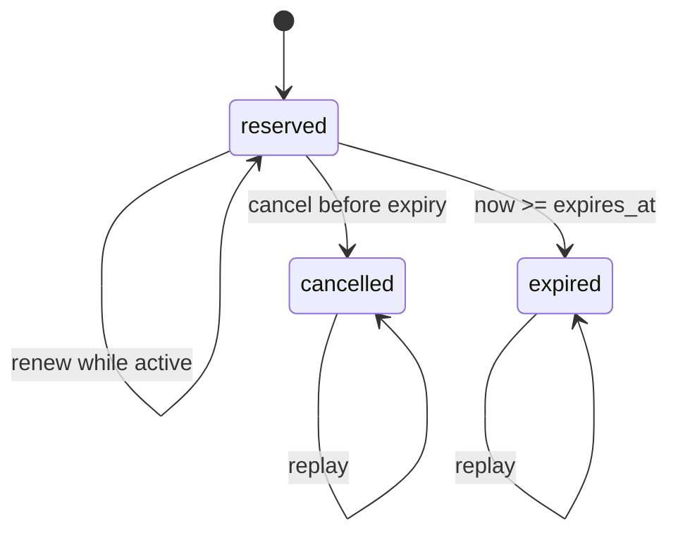

# Design decisions for the agent writing code

The [five principles](../SPECIFICATION.md) become useful when they change a design choice. This guide concerns source structure, not repository metadata.

## Start from an invariant, then choose its owner

A reservation library needs to preserve available stock while handling replay and cancellation. A price calculator needs to preserve integer amounts and reconcile line allocations with totals. These are different invariants and justify different shapes.

A small pure pricing function can be the correct starting point. A stateful inventory object can also be the correct starting point. Forcing both into identical layers would add concepts before it adds a useful contract.

| Decision | Prefer | Reconsider when |
|---|---|---|
| Policy location | One named owner for one domain decision | Two rules that look alike evolve independently |
| Module split | A boundary at which callers can stop reading | Calls merely forward through a chain of wrappers |
| Interface | A stable contract around real variation or complex effects | It only renames one trivial helper |
| State | Private representation and invariant-preserving operations | A global owner combines unrelated resources |
| Data at boundaries | Validated domain values, explicit units and snapshots | Copying or parsing dominates cost; use a defined ownership/borrowing contract |
| Workflow | Named orchestration exposing meaningful order and effects | Inlining a known framework recreates its complexity |
| Failure | Domain errors or explicit result variants | Callers must inspect strings or infer which partial writes survived |
| Extension | A direct implementation until variation is real | Repeated variation justifies a strategy, registry, or shared algorithm |

## Build a useful stopping boundary

A contract is useful when it answers enough for a caller to proceed without reconstructing implementation details. For a reservation operation, that includes:

```text
reserve(request_id, sku, quantity)

Success: stock is reserved exactly once for that request signature.
Replay: the original request's current state is returned.
Conflict: reusing the ID with another signature fails.
Failure: insufficient stock does not consume the ID or change availability.
Ownership: the returned value cannot mutate the inventory's internal state.
Concurrency: either explicitly unsupported or enforced at the owner boundary.
```

These are properties of the API and implementation. They can be expressed through types, contracts, exceptions, tests, and concise documentation. A separate manifest adds no guarantee.

A contract that says only “reserves stock” leaves the next agent to reverse-engineer the semantics that matter most during change.

## Give a pure algorithm a name when it removes repeated reasoning

Discount allocation illustrates a useful extraction. “Apply a percentage” becomes a distinct algorithm when eligibility, caps, exact cents, and deterministic tie-breaking interact.

A function such as `allocate_discount(subtotals, eligible, discount_cents)` can isolate the integer invariant: allocated amounts sum exactly to the discount and no row is over-discounted. A caller can then calculate tax from the resulting net amounts.

A generic configurable pricing framework is a different commitment. It may be worthwhile for independently deployed policy plugins. It is not necessary merely because the current algorithm has several steps.

The extraction decision depends on the semantic contract, not a rule that every calculation deserves a class.

## Make temporal state part of the model

Adding expiration changes the inventory's state machine:



An implementation must distinguish original request identity from evolving state. Renewal can change the deadline without changing the parameters used to detect a conflicting replay. Those are separate facts; storing only the current deadline loses information.

Every public observer that promises current state must apply the same expiration semantics. Copying a deadline check into unrelated methods makes drift more likely. A shared transition operation or a clearly defined derived-state policy is a candidate solution. Tests should challenge all relevant entry points.

This is architectural guidance: represent distinct domain facts distinctly, and give transitions one authority. It does not require a state-machine framework.

## Expose effects without pretending they are pure

A useful shape for many applications is:

```text
external input
    -> validate / construct domain values
    -> deterministic decision
    -> explicit effect execution
    -> observable outcome
```

Do not force this split when it only adds forwarding functions. Keep it when it lets the agent test policy separately or reason about the transaction/effect boundary.

The pure core does not prove the effect is safe. A real adapter must cover database constraints, I/O failures, and the actual transaction contract. A test using a fake ledger cannot demonstrate that a production database atomically stores a record and an outbox event.

Keep mutable-state checks inside the required consistency boundary. Evaluate against a consistent snapshot and commit within the same transaction or version check, or revalidate at commit. Moving a check outside that boundary just to make a calculation pure can introduce a time-of-check/time-of-use race.

Preserve required security, compatibility, latency, resource use, and availability when choosing a simpler reading path. Code that is easier to reconstruct but violates an operational contract is not an improvement.

## Handle asynchronous and distributed behavior explicitly

For a message handler, workflow, or service interaction, identify:

- who owns each state transition and which invariant spans owners;
- the idempotency key, its scope, retention, and replay result;
- ordering assumptions and what happens under duplicate or reordered delivery;
- timeout and cancellation semantics, including late completion;
- transaction boundaries and partial failure;
- recovery, compensation, and the observable evidence of completion.

These semantics belong in code and interface contracts. A trace or diagram cannot substitute for them. “Exactly once” must name the system boundary under which the guarantee holds.

Single ownership need not mean one machine or one writer. A replicated owner can use consensus, transactional constraints, conflict resolution, or commutative operations. The relevant question is whether another agent can recover and preserve that rule.

## Use objects, functions, and frameworks deliberately

**Objects** are useful for preserving state behind operations. Inheritance is useful when substitution has a stable semantic contract; it becomes costly when understanding one operation requires reconstructing several unrelated hooks.

**Functions** are useful for explicit transformations and orchestration. A pipeline of opaque higher-order helpers can be as difficult to follow as a deep class hierarchy.

**Frameworks** can compress context because agents know their conventions. Prefer standard extension points to bespoke infrastructure when they make behavior more predictable. Keep application-specific policy and surprising effects visible.

**Generated code** can preserve consistency and expose regular structure. Keep its authority and regeneration path explicit. Do not ask an agent to edit generated artifacts while the next build overwrites its decision.

No paradigm is automatically AGENT-friendly. Judge the actual meaning and change path exposed to its consumer.

## A small review before committing to a design

1. Which invariant am I preserving, and where is it owned?
2. What must another agent read to change this policy?
3. What details can the caller safely ignore?
4. Where do state, time, configuration, and external effects enter?
5. What happens on retry, conflict, cancellation, and partial failure?
6. Which concrete execution could show my design is wrong?

If the answers require inventing extensive metadata before the source makes sense, first reconsider the source and its contracts.
